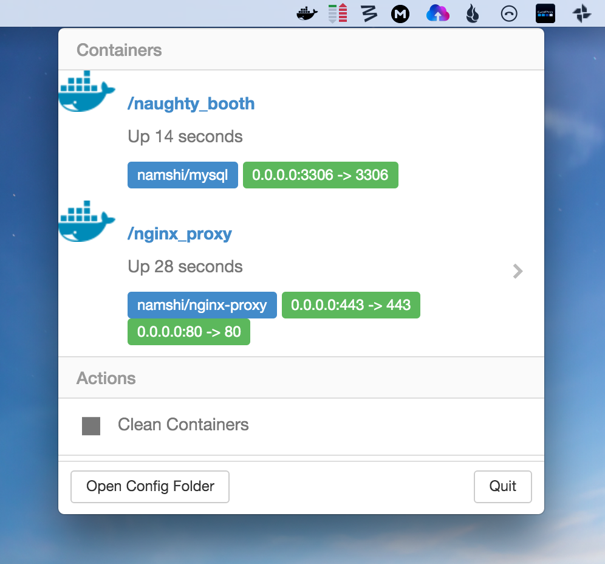

### DockerTab

With DockerTab you will be able to visualize informations about your docker containers through a UI interface 



### Connection to your Docker

By default docker is not able to receive commands from a different host, but if you are using `boot2docker` the configuration is already setted up to listen for outside connection. Otherwise you have to change the configuration adding `-H tcp://0.0.0.0:2375`. Like this:

```sh
# /lib/systemd/system/docker.service
ExecStart=/usr/bin/docker -d -H tcp://0.0.0.0:2375 -H fd://
```

### Notes

* based on https://github.com/maxogden/monu
